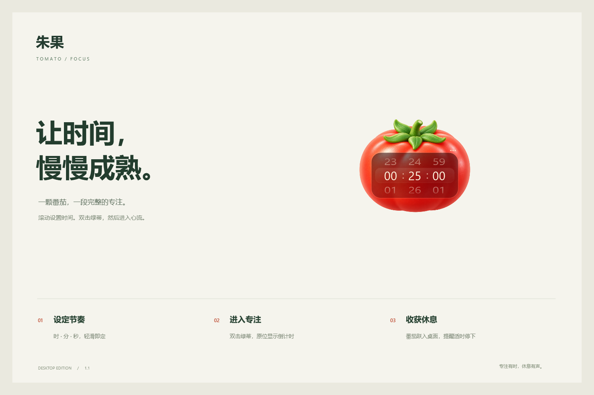

# 朱果 · Tomato Focus

[English](README.md) | 简体中文

[](https://github.com/Dante9k/tomato-focus/actions/workflows/ci.yml)

**一颗番茄，一段完整的专注。**

适用于 Windows 的透明桌面番茄钟。圆润软陶风格、细腻柔光与紧凑尺寸，中央时间滚轮支持惯性滑动；时间到后，小番茄从当前番茄所在位置持续抛出，用轻巧的动画提醒你休息。



## 使用

1. 调整番茄中央的 **小时／分钟／秒**。支持滚轮、上下拖动、点击相邻数字；Tab 切换列，方向键微调，也可直接输入数字。
2. **双击绿蒂开始**，番茄以460ms向右上角平滑缩至125 × 125逻辑像素、淡至32%不透明度并保持置顶，编辑框完全隐去，以笔画稍宽、字形偏扁的圆角等宽镂空数字显示倒计时，内部透出淡白光；不足一小时显示分秒，达到一小时显示时分秒。缩小后倒计时仍保持清晰。取消专注恢复原尺寸和原色，到时恢复大番茄提醒。果身底部双击或 Enter 也可开始；专注中再次双击不会重新计时。
3. 时间到后，番茄留在当前所在的位置，平滑恢复提醒大小，并从果蒂向整个桌面连续投掷小番茄。投出播放轻柔掠空声，真实触地时播放柔软撞击声，反弹后再次落地更轻；声音位置与画面左右位置对应。
4. **拖动或双击大番茄停止提醒**，也可以按 Esc。

任务栏通知区域的番茄图标可找回窗口、查看剩余时间、取消计时和退出。计时中拖住果身快速来回摇晃即可取消专注，中央恢复原先设定的可编辑时长；普通拖动只移动位置。右击托盘图标、番茄或点击 `···` 可打开统一的深松绿配置面板，提供 25／5／15 分钟预设、独立的到时提示音、拨轮音效、投掷与落地音效开关，以及带音效的 8 秒动画预览。停止提醒同时停止所有投掷和落地声音。

主窗口 **250 × 250 个逻辑像素**，选中数字 24 像素，每列拨轮宽 48 像素。编辑时使用 `00:25:00` 数字排列，不显示时／分／秒文字；悬停和辅助功能仍说明每列含义。可设置 1 秒至 23:59:59。数字沿滚筒弧面翻转，松手后惯性停靠到完整数字；跨格播放原创的短促机械卡点声。关闭系统动画时直接切换数字。提示音在到期时播放一次，正式动画持续到手动停止。

兼容 Windows 接口和硬件时，菜单会显示独立的「轻触震动」选项。普通鼠标或旧版 Windows 使用声音和回弹；本机 Windows 10 已验证降级路径，真实触觉效果尚未在兼容硬件上验收。接口要求见 [微软文档](https://learn.microsoft.com/en-us/windows/apps/develop/input/haptics)。

## 运行条件

最新验证包可从 [Windows 自动构建](https://github.com/Dante9k/tomato-focus/actions/workflows/ci.yml) 的成功记录中下载 `tomato-focus-win-x64` 产物。

- Windows 10 / 11，x64，.NET Framework 4.8。
- 图形安装器支持编辑完整安装路径，或点击「浏览」选择专用空文件夹。默认位置为 `%LOCALAPPDATA%/Programs/TomatoFocus/1.1.15`，也可安装到其他有写入权限的本地磁盘目录，支持中文和空格。路径框显示的就是实际安装位置，不会额外追加子目录。
- 已有空文件夹可直接安装；已有安装仅在所有文件与当前包完全一致时复用。其他非空目录不会被覆盖，升级时请选择新的版本目录。安装器只使用当前用户权限，无权写入时会提示重新选择位置。
- 解压便携包，双击 `Tomato.exe`，无需安装或管理员权限。
- 不需要联网，不包含登录、遥测或开机自启。

安装前请从托盘正常退出正在运行的朱果。安装器会创建开始菜单快捷方式，可选创建桌面快捷方式；已有同名快捷方式会先备份。它不会自动启动应用，也不会修改已有计时状态。当前安装器不注册到 Windows「已安装的应用」；卸载时正常退出后删除所选安装文件夹及快捷方式即可，用户设置默认保留。

软件正在迭代中，当前便携包未做企业代码签名。实际性能、混合 DPI、多屏与辅助技术验收边界见 [验证记录](docs/VALIDATION.md)。

## 构建

仓库不依赖第三方 NuGet 包。Windows 自带的 .NET Framework 编译器即可构建：

```powershell
./build.ps1 -Test
./package.ps1
./scripts/check-package.ps1
# 安装到当前用户目录并创建快捷方式；请先从托盘正常退出旧版本
./scripts/install-local.ps1 -Launch
```

输出位置：

| 输出 | 位置 |
| --- | --- |
| 正式桌面程序 | `build/Tomato.exe` |
| 开发用验证工具 | `build/Tomato.Verify.exe` |
| 可分发程序与双语文档 | `dist/TomatoFocus-1.1.15-win-x64/` |
| 便携 ZIP 与 SHA-256 | `dist/` |
| Windows 图形安装包 | `dist/TomatoFocus-<版本>-Setup.exe`，通过 `./package.ps1` 自动生成 |
| 网站 ZIP | `dist/`，通过 `./scripts/build-website.ps1` 生成 |

正式压缩包通过明确的文件清单打包，不包含验证工具、运行状态、日志、调试符号或开发缓存。源代码仓库不跟踪 `build/` 和 `dist/`。

开发用 `install-local.ps1` 脚本仍使用固定的 `%LOCALAPPDATA%/Programs/TomatoFocus/<版本>` 路径；自选目录请使用图形安装器。脚本会备份设置及快捷方式信息，保留旧程序；回退路径记录在该目录上级的 `backups` 中。升级不添加开机自启、不修改杀毒软件设置。若安全软件拦截，应保留完整告警用于核实，不应关闭防护或自动加入白名单。

也可以在安装 .NET Framework 4.8 开发工具的 Visual Studio 中打开 **`Tomato.Focus.sln`**，选择 x64 构建。

## 验证

```powershell
# 无窗口逻辑验证
./build/Tomato.Verify.exe --self-test

# 渲染真实控件，检查编辑态和提醒态图片
./build/Tomato.Verify.exe --render-preview

# 需要交互桌面，会显示约 17 秒动画，结束后自动退出
./build/Tomato.Verify.exe --smoke-test

# 临时目录内验证自定义安装与快捷方式，不改动日常安装
./build/Tomato.Verify.exe --installer-test ./dist/TomatoFocus-1.1.15-Setup.exe
```

结果位于 `build/*-results.txt`。桌面流程验证使用独立状态文件，不操作日常计时状态。安装器检查覆盖中文／空格路径、新建／空目录、重复安装、非空目录保护、不可写位置及自定义目标快捷方式。自动流程调用应用动作，不替代实际鼠标和触屏验收。

GitHub Actions 在 Windows 上执行构建、逻辑验证、控件渲染、打包及校验，并保存图形安装包、便携包及校验文件。所有版本均从 `assets/brand/tomato-focus.png` 自动导出品牌图标，应用、快捷方式及安装窗口默认沿用这套品牌；版本号来自 `VERSION`，无需逐版本嵌入或配置。桌面动画验收需在可交互 Windows 会话中执行。

推送到 `main` 后，GitHub Actions 会从经过白名单校验的网站包自动发布 GitHub Pages 官网。创建与 `VERSION` 一致的 `v<版本>` 标签后，会自动建立 GitHub Release，并上传安装包、便携包、网站包及各自的 SHA-256 校验文件。

## 项目结构

```text
Tomato.Focus.sln
src/Tomato.Focus/
  Application/       生命周期、托盘、计时协调
  Domain/            倒计时状态机与运动物理
  Infrastructure/    状态存储、偏好设置、Windows 互操作
  Presentation/      窗口、滚轮、动画和素材绘制
  Properties/        程序元数据
tests/Tomato.Focus.Verification/
scripts/             构建、打包、安装器与验证脚本
assets/              内嵌图像、图标与素材来源
docs/                架构、验收记录和预览图
website/             宣传页源码、下载入口与独立部署配置
marketing/           宣传视频、封面与发布文案源文件
.github/             自动构建、Issue 和 PR 模板
```

生成文件集中存放：`build/` 为编译输出，`artifacts/` 为验证截图，`dist/` 为当前版本交付文件及宣传素材。`website/assets/`、`website/downloads/` 与 `website/release.js` 由网站构建生成，网站 ZIP 按白名单只收录当前版本及逐文件哈希清单。以上生成内容均不纳入 Git；已安装的旧版本和用户设置不属于源码清理范围。

历史发布包、旧素材和重复工程副本不保留在源码目录；已提交内容可通过 Git 历史追溯。网页说明见 [website/README.md](website/README.md)，通用部署和回退流程见 [部署说明](website/deploy/RUNBOOK.md)。仓库不包含具体服务器运维记录。

## 状态与隐私

计时按照 UTC 截止时刻判断，休眠时间计入倒计时；程序不会主动唤醒电脑。重新打开程序时会恢复未到期计时或显示已到期提醒，程序关闭期间不会后台触发。

状态保存在当前用户的 `LocalApplicationData/TomatoFocus/state.xml`，通过临时文件和原子替换写入；损坏时使用默认设置。错误日志只留在本机。透明动画层允许点击穿透，停止提醒后解除快捷键并回收动画资源。

## 开发文档

- [架构说明](docs/ARCHITECTURE.md)
- [验证记录](docs/VALIDATION.md)
- [贡献指南](CONTRIBUTING.md)
- [安全说明](SECURITY.md)
- [版本变更](CHANGELOG.md)
- [素材来源与提示词](assets/ARTWORK.md)

本项目目前**保留所有权利**，未默认授予开源许可，详见 [LICENSE](LICENSE)。
