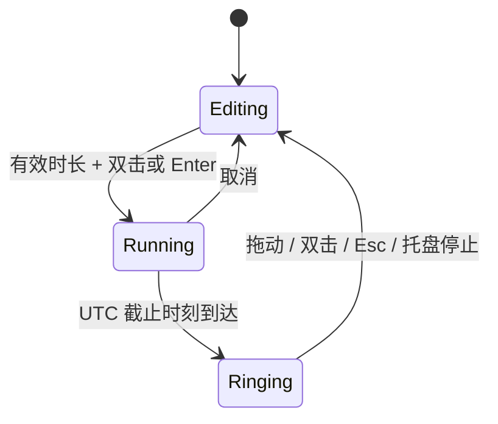

# 架构说明

## 运行模型

应用基于 .NET Framework 4.8 和 WPF。正式程序为 `Tomato.exe`，开发验证工具为独立的 `Tomato.Verify.exe`，避免将测试入口和预览生成逻辑放入用户程序。

`Program` 获取命名互斥锁，创建单一 WPF 应用，再把生命周期交给 `AppController`。托盘入口在番茄隐藏时仍然可用，关闭番茄窗口只隐藏，退出操作统一释放资源。

## 分层职责

| 层 | 职责与约束 |
| --- | --- |
| Domain | `Countdown` 维护状态与截止时刻，`Flight` 计算运动；不依赖窗口或文件系统 |
| Infrastructure | `StateStore` 原子保存 XML，`Preferences` 是序列化数据，`Native` 集中声明 Windows 互操作 |
| Presentation | WPF 透明窗口、时间滚轮、保留绘图的动画层以及图像资源 |
| Application | 协调领域对象、窗口、托盘、提示音、显示器变化和持久化 |

分层使用目录表达职责，保留单一应用程序集与统一 `Tomato` 命名空间，避免为小型桌面应用引入不必要的容器和框架。测试通过公开动作和独立领域对象验证行为。

## 计时状态

200 毫秒的 UI 轮询用于观察 UTC 截止时间，不通过累积轮询次数计时。`Tick` 只产生一次到期状态转换。重启时从保存的截止时间恢复。系统时钟被人为调整仍会影响 UTC 截止逻辑，这是当前实现的明确边界。

## 交互与缩放

桌面窗口使用 440 × 456 的设计坐标，通过固定比例 `Viewbox` 缩放为 72%。鼠标命中判断在设计画布坐标中进行，窗口拖动以屏幕坐标增量计算，投掷起点通过视觉树换算。这三种坐标不能混用。

滚轮采用连续位置与整数目标值，拖动释放后根据速度给予有限惯性，再指数收敛并吸附。时间列支持键盘输入和 UI Automation 的 RangeValue 模式。

## 动画与清理

纹理启动时解码并冻结，飞行图像预缩小。每个活动番茄使用独立、可复用的 `DrawingVisual`，每帧只更新变换矩阵与透明度。物理以最多 16 毫秒的子步推进，长时间暂停后最多追赶 80 毫秒。

同时活动的果实上限为 36；落地仅反弹一次，寿命与边界条件负责回收。停止提醒会关闭透明窗口、解绑逐帧事件、清空粒子、停止提示音并注销 Esc。点击穿透和无激活样式仅应用于全屏动画窗口。

## 构建与发布

`scripts/build.ps1` 以编译警告为错误，分别生成正式应用和验证程序；Release 不生成含本机路径的 PDB。Visual Studio 工程与脚本共用同一套源文件、资源、清单和应用配置。

`scripts/package.ps1` 执行验证、渲染与白名单打包，输出 SHA-256。`scripts/check-package.ps1` 对压缩包入口与哈希再次检查。GitHub CI 使用只读仓库权限与固定提交的 Actions，避免在拉取请求中获得发布权限。

本版本不自动向 GitHub Releases 发布，不存储签名证书，不自动合并依赖升级。商业分发需要另行确定许可证、代码签名和硬件验收方案。
