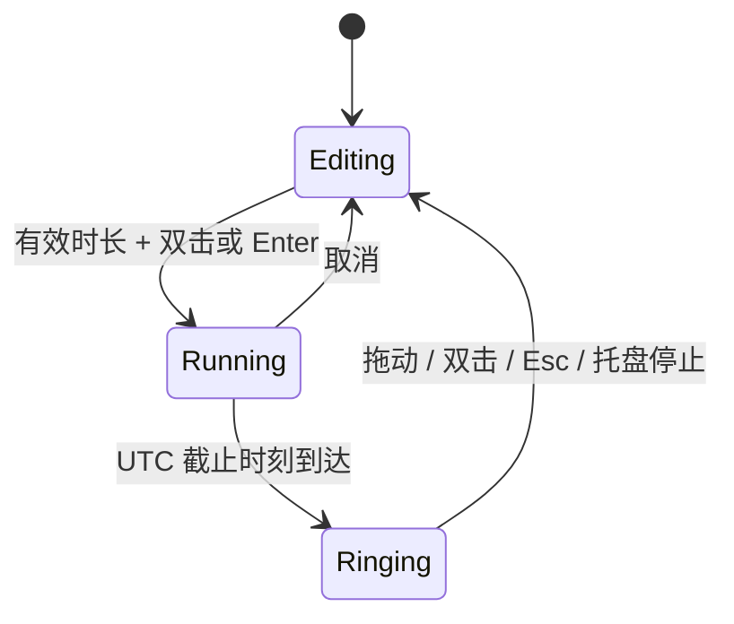

# 架构说明

## 运行模型

应用基于 .NET Framework 4.8 和 WPF。正式程序为 `Tomato.exe`，开发验证工具为独立的 `Tomato.Verify.exe`，避免将测试入口和预览生成逻辑放入用户程序。

`Program` 获取命名互斥锁，创建单一 WPF 应用，再把生命周期交给 `AppController`。托盘入口在番茄隐藏时仍然可用，关闭番茄窗口只隐藏，退出操作统一释放资源。

## 分层职责

| 层 | 职责与约束 |
| --- | --- |
| Domain | 倒计时、飞行物理、摇晃检测、逐格限频与拨轮阻尼运动；不依赖窗口或文件系统 |
| Infrastructure | XML 状态保存、偏好设置、预加载拨轮音效、可选触觉接口与 Windows 互操作 |
| Presentation | WPF 透明窗口、时间滚轮、保留绘图的动画层以及图像资源 |
| Application | 协调领域对象、窗口、托盘、提示音、显示器变化和持久化 |

分层使用目录表达职责，保留单一应用程序集与统一 `Tomato` 命名空间，避免为小型桌面应用引入不必要的容器和框架。测试通过公开动作和独立领域对象验证行为。

## 计时状态

200 毫秒的 UI 轮询用于观察 UTC 截止时间，不通过累积轮询次数计时。`Tick` 只产生一次到期状态转换。重启时从保存的截止时间恢复。系统时钟被人为调整仍会影响 UTC 截止逻辑，这是当前实现的明确边界。

## 交互与缩放

编辑窗口和设计画布为250 × 250 DIP，专注时以右上角为固定点缩至125 DIP并淡化果实，隐藏编辑底板，仅显示倒计时。缩放使用画面变换，动画结束时一次性同步原生窗口的位置和尺寸；保存展开位置以避免重启偏移。鼠标命中判断在画布坐标中进行，拖动先将屏幕像素转换为DIP增量，摇晃检测使用屏幕DIP与单调时间。

到时在当前锚点恢复提醒大小，不重新定位到屏幕角落。每次投出时，将果蒂通过视觉树和屏幕物理坐标转换到投掷窗口坐标，因此发射点会跟随恢复动画；关闭投掷窗口时释放起点回调。

滚轮采用连续位置与整数目标值，拖动释放后承接速度并通过解析阻尼弹簧吸附。数字按圆柱角度投影到屏幕，纵向透视压缩并随边缘渐隐；数字排版、画笔与遮罩缓存复用。关闭系统动画时直接切换数字。时间列支持键盘输入和 UI Automation 的 RangeValue 模式。

显示数字跨过半格边界时发出独立的逐格事件；声音与触觉最多每 50ms 接受一次，不排队补播。三种 40ms PCM 在启动时合成并预加载，逐次轮换；开始计时前停止拨轮反馈，再由独立的到时提示音逻辑接管。程序赋值保持静音。

专注时，原编辑区隐藏并禁用拨轮，由单独的只读数字显示剩余时间，避免覆盖预设。取消或停止提醒后恢复原来的编辑时长。预设与截止时间沿用原 XML 字段；旧静音偏好用于首次初始化独立拨轮声音开关。

## 动画与清理

纹理启动时解码并冻结，飞行图像预缩小。每个活动番茄使用独立、可复用的 `DrawingVisual`，每帧只更新变换矩阵与透明度。物理以最多 16 毫秒的子步推进，长时间暂停后最多追赶 80 毫秒。

同时活动的果实上限为 36；落地仅反弹一次，寿命与边界条件负责回收。停止提醒会关闭透明窗口、解绑逐帧事件、清空粒子、停止提示音并注销 Esc。点击穿透和无激活样式仅应用于全屏动画窗口。

首次触地反弹、第二次触地停留并在320ms内淡出。`Flight.Impacted` 每个物理步重置；`ThrowSurface` 只在实际投出及可见地面接触时发出 `FlightSoundEventArgs`，不另设音效计时器。碰撞力度使用碰撞前的垂直速度。

`ThrowFeedback` 启动时生成短促掠空声，并解码三个内嵌的CC0柔软碰撞PCM样本，按大小、速度、接触阶段和水平位置决定音量与声像。`EffectMixer` 使用16声部上限、复用混音缓冲及软限幅；首播等待超过100ms的事件直接丢弃，满载时优先保留碰撞。`NativeWaveOutput` 在独立线程使用三个10ms立体声缓冲，通过 Windows [WaveOut 事件回调](https://learn.microsoft.com/en-us/windows/win32/api/mmeapi/nf-mmeapi-waveoutopen) 输出。停止后 reset、归还缓冲并关闭设备；UI最多等待200ms，不被故障驱动无限阻塞。设备失败时不影响计时和动画。旧版到时静音偏好初始化独立的投掷音效开关。

## 构建与发布

`scripts/build.ps1` 以编译警告为错误，分别生成正式应用和验证程序；Release 不生成含本机路径的 PDB。Visual Studio 工程与脚本共用同一套源文件、资源、清单和应用配置。

`scripts/package.ps1` 执行验证、渲染与白名单打包，输出 SHA-256。`scripts/check-package.ps1` 对压缩包入口与哈希再次检查。GitHub CI 使用只读仓库权限与固定提交的 Actions，避免在拉取请求中获得发布权限。

本版本不自动向 GitHub Releases 发布，不存储签名证书，不自动合并依赖升级。商业分发需要另行确定许可证、代码签名和硬件验收方案。
